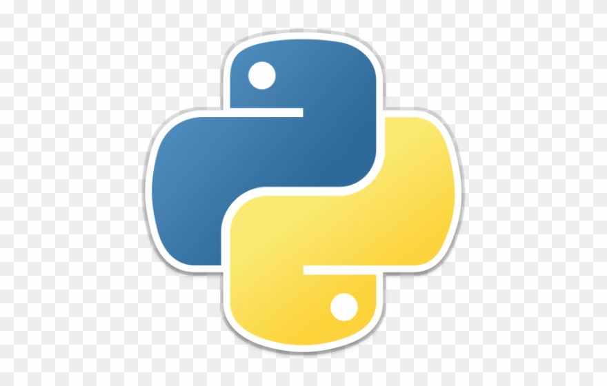

# E-commerce Empresax

Este é um **e-commerce** para a *empresa X*, feito em PHP e MySQL.

## Funcionalidades:

**Checkout, _Tela de produto_, Catáçogo, Home com banner**

###### Melhorias do projeto:

__Melhoria 1__, _melhoria 2_

### Linguagens do projeto:

* HTML
* CSS
* JavaScript
* PHP
* MySQL

### Funcionalidades a desenvolver:

1. Área  de membros
    1. Login diferente para grupos de cliente
    2. Desconto especial para grupos de cliente
    3. CSS diferente para grupos de cliente
2. Integração com outros pagamentos
3. Sistema de bônus primeira compra

#### Imagem local

### Imagem externa

## Links interessantes:

[Google](https://www.google.com)

[http://www.horadecodar.com.br](http://www.horadecodar.com.br)

Contribuidor principal: https://github.com/will-morais

